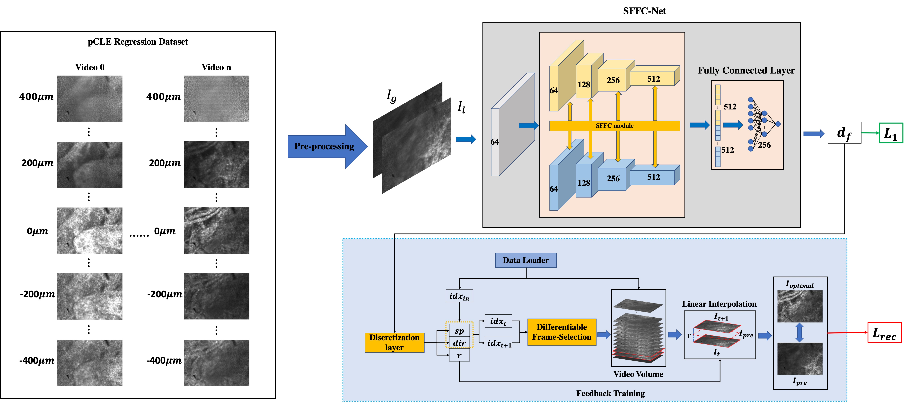

# SFFC-Net
## MICCAI 2022
PyTorch implementation. For details, see **Deep Regression with Spatial-Frequency Feature Coupling and Image Synthesis for Robot-Assisted Endomicroscopy**.  
[[`paper`](https://doi.org/10.1007/978-3-031-16449-1_16)]


## pCLE Regression Dataset 
The dataset is avaliable [[`here`](https://zenodo.org/records/7147878)]

### code for training
```python
python3 train.py --norm --in_channels 2 --out_channels 1 --checkpoint_dir SFFC-Net --model_type fft_resnet18 --num_epochs 40 --cyclic_lr --batch_size 16 --use_interp

